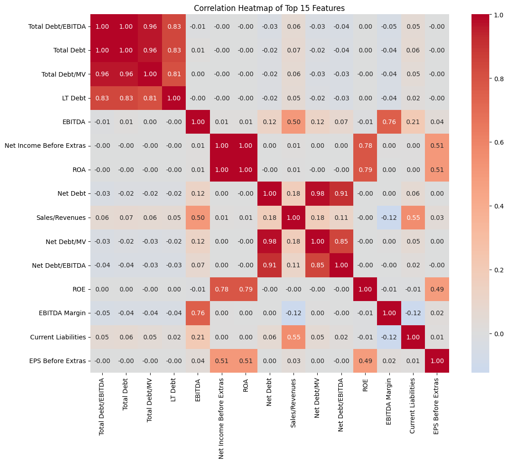
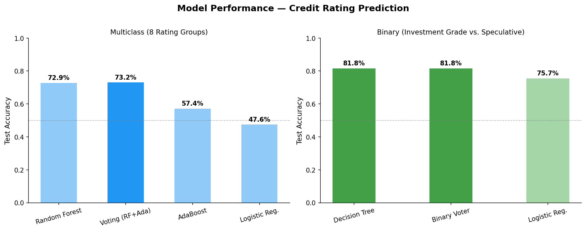
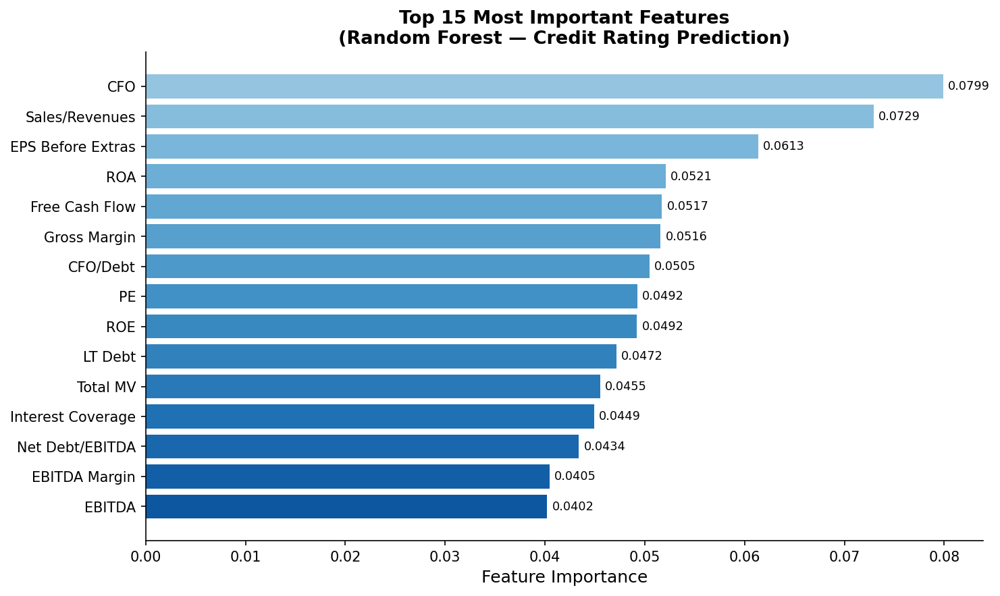

# IE498 Machine Learning in Finance
Machine Learning models for credit rating prediction and economic cycle forecasting using financial indicators and yield curve data.

## Overview

This repository contains two machine learning projects. Both projects apply supervised learning techniques to real-world financial datasets.

---

## Model Insights

### Correlation Heatmap


### Model Performance


### Feature Importance


---

## Projects

### 1. Credit Rating Prediction (`MLF_GP1`)

**Goal:** Predict corporate credit ratings using financial ratios and accounting metrics.

**Dataset:** `MLF_GP1_CreditScore.csv` — 1,700 corporate observations with 26 financial features (EBITDA, ROA, ROE, Debt ratios, etc.) and Moody's credit ratings as targets.

**Tasks:**
- **Binary classification:** Investment grade vs. speculative grade (`InvGrd`)
- **Multiclass classification:** Predict one of 8 rating groups (`Rating_Group`)

**Models implemented:**
| Model | Task | Best CV Accuracy |
|---|---|---|
| Random Forest | Multiclass | 67.4% |
| AdaBoost | Multiclass | 55.6% |
| Logistic Regression | Multiclass | 44.5% |
| Voting Ensemble (RF + Ada) | Multiclass | 67.5% |
| Decision Tree | Binary | 78.6% |
| Logistic Regression | Binary | 75.7% |
| Voting Ensemble (DT + LR) | Binary | 78.6% |

**Evaluation metrics:** Accuracy, cross-validated accuracy (RepeatedStratifiedKFold, 5-splits × 2 repeats)

---

### 2. Economic Cycle Forecasting (`MLF_GP2`)

**Goal:** Forecast economic cycle indicators using yield curve and credit spread data.

**Dataset:** `MLF_GP2_EconCycle.csv` — 223 monthly observations (1979–present) with Treasury yield indices, commercial paper rates, and the US Philadelphia Fed Coincident Index (USPHCI).

**Models implemented:**
- Linear Regression, Ridge, Lasso, ElasticNet (with cross-validated regularization)
- Random Forest Regressor
- Gradient Boosting Regressor
- HistGradientBoosting Regressor
- SVR (Support Vector Regression)
- Voting / Stacking Ensembles
- PCA for dimensionality reduction

**Evaluation metrics:** RMSE, MAE, R²

---

## Repository Structure

```
.
├── data/
│   ├── MLF_GP1_CreditScore.csv       # Credit rating dataset (1,700 rows)
│   └── MLF_GP2_EconCycle.csv         # Economic cycle dataset (223 rows)
│
├── notebooks/
│   ├── IE498_Project_CreditScore.ipynb   # Credit rating notebook
│   └── EconCycle.ipynb                   # Economic cycle notebook
│
├── reports/
│   ├── CreditScore.pdf               # Final report — Credit Rating project
│   └── EconCycle.pdf                 # Final report — Economic Cycle project
│
├── requirements.txt
├── .gitignore
└── README.md
```

---

## Getting Started

### 1. Clone the repository

```bash
git clone <repo-url>
cd <repo-name>
```

### 2. Install dependencies

```bash
pip install -r requirements.txt
```

### 3. Run the notebooks

```bash
jupyter notebook
```

Then open either notebook from the `notebooks/` directory. The notebooks use relative paths (`../data/`) and will run top-to-bottom without any manual path edits.

---

## Dependencies

| Package | Purpose |
|---|---|
| `pandas` | Data loading and manipulation |
| `numpy` | Numerical computing |
| `scikit-learn` | ML models, pipelines, tuning |
| `matplotlib` | Plotting |
| `seaborn` | Statistical visualization |
| `scipy` | Statistical tests |
| `jupyter` | Notebook environment |

Install all at once: `pip install -r requirements.txt`

---

## Course

**IE498 — Machine Learning in Finance**
University of Illinois Urbana-Champaign

